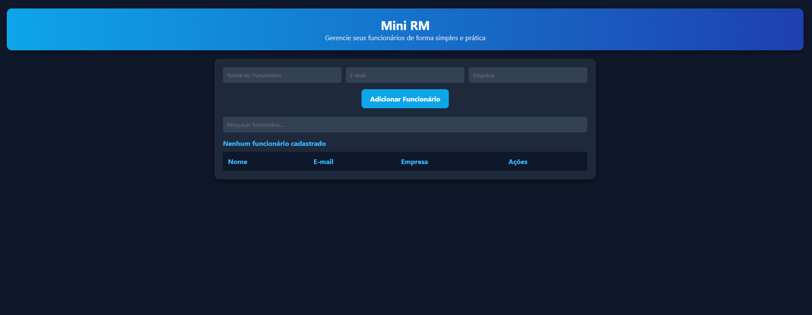

<h1 align="center">Mini RM</h1>

Aplicação desenvolvida para treinar e demonstrar minhas habilidades em JavaScript, HTML e CSS, criando um sistema funcional inspirado em sistemas de gestão corporativa.  
O Mini RM permite ao usuário gerenciar funcionários de forma prática, rápida e intuitiva, com foco em responsividade e usabilidade.

 

  

  <a href="https://saldanhasts.github.io/mini-rm" target="_blank">▶️ Ver projeto ao vivo</a>

## 🚀 Tecnologias

Esse projeto foi desenvolvido com as seguintes tecnologias:

- HTML5
- CSS3
- JavaScript (Vanilla)
- Git e GitHub

## 💻 Projeto

O **Mini RM** é um sistema web para gerenciar funcionários de forma simples e prática.  
O usuário pode:

- Adicionar novos funcionários  
- Editar informações existentes  
- Remover funcionários  
- Pesquisar rapidamente por nome, e-mail ou empresa  
- Visualizar um contador atualizado de funcionários cadastrados  

O sistema é **totalmente responsivo**, adaptando-se a desktops, tablets e smartphones, garantindo boa experiência para todos os usuários.

## 🎯 Objetivo do projeto

- Colocar em prática **conhecimentos de front-end**.  
- Criar um código **limpo, organizado e bem comentado**, seguindo boas práticas.  
- Desenvolver um sistema inspirado em produtos corporativos (como RM/TOTVS) para demonstrar um pouco da minha criatividade e capacidade técnica.  
- Proporcionar uma aplicação prática que pode ser facilmente expandida ou integrada a sistemas maiores no futuro.

---

Desenvolvido por **Marcus Vinícius Saldanha**.
